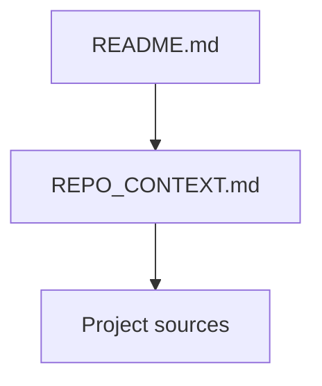

# AI Repository Context

AI Repository Context is a small, open Markdown convention for humans, AI assistants, and other tools. A root-level `REPO_CONTEXT.md` maps existing project sources, explains their authority, and says when to read them.

Project context is often spread across state records, plans, architecture, decisions, and evidence. The map helps readers find the relevant information without rediscovering the documentation structure or reading everything.

For project context and task-specific reading guidance, see [REPO_CONTEXT.md](REPO_CONTEXT.md).



## Adopt the convention

1. Copy the reusable [templates/REPO_CONTEXT.md](templates/REPO_CONTEXT.md) into the adopting repository as root-level `REPO_CONTEXT.md`.
2. Adapt the copied map to that repository's existing authoritative sources: replace placeholders with links, explain topic authority, and state when to read each source. Account for missing information explicitly.
3. Add this sentence to your root README:

   ```markdown
   For project context and task-specific reading guidance, see [REPO_CONTEXT.md](REPO_CONTEXT.md).
   ```

Existing instruction files may also link to the map. No assistant or tool is assumed to discover it automatically. Keep the map in `REPO_CONTEXT.md`; do not copy it into the README.

Keep routine project state in its existing authoritative sources. `REPO_CONTEXT.md` is a map, not a status journal; update it when source locations, authority, or reading rules change.

## Load context progressively

1. Start with the context map and applicable repository guidance.
2. Use the task to select relevant sources.
3. Read those sources; expand only when the task needs more context.
4. Stop when the sources support an answer or identify a specific gap.

Preserve the repository's required reading and approval rules throughout.

## Read further

- [Specification](SPEC.md): the universal Core and reader behavior; the sole normative definition.
- [Feature-based example](examples/feature-based.md): a fictional notes application.
- [Phase-based example](examples/phase-based.md): a fictional workshop-planning project.
- [Generalization validation](examples/generalization-validation.md): four additional fictional work models and edge cases.
- [Research and manual acceptance checklist](docs/research.md): alternatives, rationale, and bounded validation.

Each fictional example includes every source it references.

## Status

The repository is publicly published. This reference package defines convention version **0.1**, an open proposal. No formal tagged v0.1 release or GitHub Release exists. This repository has no maintained work tracker.

## Maintaining this package

Documentation changes are this package's work units; there is no formal lifecycle or recorded work queue. Keep the specification, template, and examples consistent, and use the manual checklist before handoff.

## License

Original convention text, template, and fictional examples are dedicated under [CC0-1.0](LICENSE). External research sources remain references and retain their own terms.
